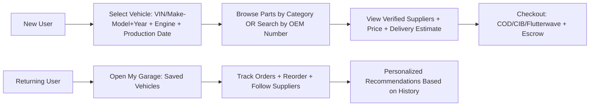
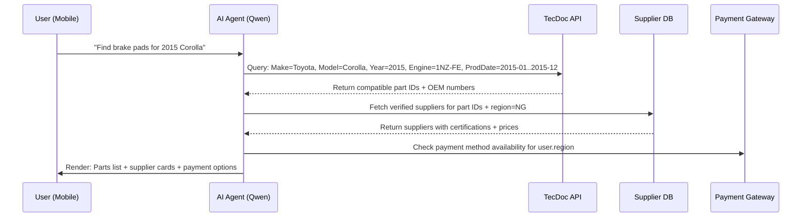

# Autopro AI Context

**Last Updated:** 2026-05-06

If the conversation is lost, paste this file and say: "Continue Autopro from this context."

---

# Quick Summary

Autopro is an automotive marketplace platform for Algeria & Nigeria.

Current Phase: Building storefront pages (mobile-only workflow)

Live Site: https://autopro-i38e.vercel.app/

---

# Owner Constraints (CRITICAL)

| Constraint | Solution |
|------------|----------|
| No laptop | Use phone browser only |
| No coding skills | Copy-paste code snippets |
| No terminal/commands | Use GitHub web interface |
| Limited budget | Free tools only (GitHub, Vercel, Supabase) |

DO NOT suggest: Codespaces, Terminal commands, npm/yarn commands, Complex workflows

ALWAYS provide: Exact file paths, Complete copy-paste code, Step-by-step GitHub web instructions, One file at a time

---

# Tech Stack

| Tool | Purpose | Status |
|------|---------|--------|
| GitHub | Code storage | Active |
| Vercel | Hosting | Connected |
| Next.js 14 | Framework | Working |
| Tailwind CSS | Styling | Configured |
| Supabase | Database | Next phase |

---

# Project Structure

Autopro/
  apps/
    storefront/
      src/
        app/
          components/
            Header.tsx (DONE)
          search/
            page.tsx (DONE)
          services/
            page.tsx (DONE)
          garage/
            page.tsx (DONE)
          cart/
            page.tsx (DONE)
          login/
            page.tsx (DONE)
          globals.css (DONE)
          layout.tsx (DONE)
          page.tsx (DONE)
  docs/
    AI_CONTEXT.md (this file)
    CURRENT_STATUS.md
    PROJECT_LOG.md
    SYSTEMS_INDEX.md
    Plus 30+ specification files (DONE)
  packages/
    shared/

---

# Completed Pages

| Page | URL | Status |
|------|-----|--------|
| Homepage | / | LIVE |
| Search/Parts | /search | LIVE |
| Services | /services | LIVE |
| My Garage | /garage | LIVE |
| Cart | /cart | LIVE |
| Login | /login | LIVE |
| Header | All pages | LIVE |

---

# Design System

| Element | Value |
|---------|-------|
| Primary Color | #6FB81A (Autopro Green) |
| Background | #0B0E11 (Canvas) |
| Surface 1 | #1E293B |
| Surface 2 | #334155 |
| Font | Inter |
| Style | NVIDIA + Binance + Alipay hybrid |

---

# Current Phase: STOREFRONT BUILD

## Completed
1. Documentation phase (30+ spec files)
2. Folder structure on GitHub
3. Vercel deployment connected
4. Core storefront pages (6 pages)
5. Header navigation with links

## Next Steps (In Order)
6. Connect Supabase database
7. Product detail page (/part/[id])
8. Service detail page (/service/[id])
9. Checkout page
10. User authentication (real login)
11. User dashboard
12. Design polish (icons, animations, 3D hero)
13. Admin dashboard (separate app)

---

# How To Create A New Page

Step 1: Go to GitHub then apps/storefront/src/app/
Step 2: Tap Add file then Create new file
Step 3: Type folder/filename like: pagename/page.tsx
Step 4: Paste code provided by AI
Step 5: Tap Commit changes
Step 6: Wait 1-2 minutes for Vercel to deploy
Step 7: Test at live URL

---

# How To Edit A File

Step 1: Go to GitHub and navigate to the file
Step 2: Click pencil icon to edit
Step 3: Delete all old content
Step 4: Paste new code
Step 5: Tap Commit changes

---

# If Build Fails

Step 1: Check Vercel then Deployments
Step 2: Look for red X
Step 3: Tell AI the error message
Step 4: AI provides fix

---

# Vercel Settings

Root Directory: apps/storefront
Framework: Next.js (auto-detected)
Build Command: npm run build

---

# Important File Locations

| What | Path |
|------|------|
| Homepage | apps/storefront/src/app/page.tsx |
| Layout | apps/storefront/src/app/layout.tsx |
| Header | apps/storefront/src/app/components/Header.tsx |
| Styles | apps/storefront/src/app/globals.css |
| Tailwind Config | apps/storefront/tailwind.config.ts |
| Package.json | apps/storefront/package.json |

---

# Recovery Instructions

If conversation crashes:
1. Open docs/AI_CONTEXT.md
2. Copy entire content
3. Paste into new AI chat
4. Add: Continue Autopro. Last completed: [page name]
5. AI will resume from exact point

---

# Already Completed (Do Not Repeat)

- Folder structure setup
- Vercel connection
- Root directory configuration (apps/storefront)
- Package.json setup
- Tailwind configuration with Autopro colors
- Design system colors
- Homepage page
- Search/Parts page
- Services page
- My Garage page
- Cart page
- Login page
- Header component

---

# Platform Vision (Full Reference)

Autopro will include:
- Vehicle parts marketplace (dropshipping)
- Service booking system
- Vehicle compatibility engine (TecDoc-ready)
- Vehicle history tracking
- Supplier dashboards
- Service provider dashboards
- Customer profiles and garage
- B2B/Fleet management
- Multi-country support (Algeria, Nigeria)
- Cash and online payments
- Admin monetization dashboard

Full specifications are in the docs/ folder.
# 🧠 AI_CONTEXT.md — Autopro Core Logic

> **Purpose**: This file defines the immutable core logic of the Autopro ecosystem. All AI agents, developers, and future iterations must align with these rules.  
> **Last Updated**: `{{TODAY}}` | **Owner**: Autopro Core Team  
> **Status**: ✅ LOCKED — Changes require consensus review

---

## 🎯 1. System Purpose & Scope

Autopro is a mobile-first, AI-powered automotive ecosystem for Algeria & Nigeria that enables:
- 🔍 **Precision part discovery** via TecDoc-style vehicle matching
- 🛒 **Seamless purchasing** with multi-payment, multi-language support
- 🚚 **Transparent logistics** with real-time order tracking
- 🤝 **Verified supplier network** with Chinese manufacturing standards

**Primary User Journeys**:


---

## 🔑 2. Core Entities & Data Model

### 2.1 Non-Negotiable Vehicle Matching Triad
To guarantee **right part, right car, zero errors**, every part query MUST include:

| Field | Source | Validation Rule |
|-------|--------|----------------|
| **VIN** OR **(Make + Model + Year)** | User input / OCR scan | VIN: 17-char ISO 3779; Make/Model: TecAlliance master list |
| **Engine Type/Code** | TecDoc API / User selection | Must match engine family code (e.g., `1NZ-FE`) |
| **Production Date Range** ⭐ | Vehicle metadata | Critical: Same model/year can have mid-year part changes (e.g., brake caliper redesign Q3 2015) [[2]] |

> 💡 **Why Production Date?** TecDoc uses K-Type numbers to differentiate vehicle variants [[2]]. Production date is the user-friendly proxy for K-Type resolution.

### 2.2 Core Entity Schema (Simplified)
```json
{
  "User": {
    "id": "uuid",
    "garage": ["vehicle_id"],
    "preferences": {"language": "en|fr|ar|ha", "payment": ["cod", "cib", "flutterwave"]},
    "memory": ["search_history", "order_history", "saved_suppliers"]
  },
  "Vehicle": {
    "id": "uuid",
    "vin": "string?",
    "make": "string",
    "model": "string",
    "year": "int",
    "engine_code": "string",
    "production_start": "YYYY-MM",
    "production_end": "YYYY-MM?",
    "region": "DZ|NG|GLOBAL"
  },
  "Part": {
    "id": "uuid",
    "oem_number": "string",
    "tecdoc_id": "string?",
    "compatible_vehicles": ["vehicle_id"],
    "suppliers": [{
      "id": "uuid",
      "certifications": ["CCC", "IATF_16949", "ISO_9001"],
      "verification_status": "pending|verified|flagged"
    }]
  }
}
```

---

## 🛡️ 3. Supplier Verification Protocol (China Focus)

### 3.1 Mandatory Certifications for Chinese Suppliers
| Certification | Purpose | Verification Method |
|--------------|---------|-------------------|
| **CCC (China Compulsory Certification)** | Mandatory for parts sold in China [[14]] | Cross-check certificate number on [CNCA official portal](http://www.cnca.cn) |
| **IATF 16949:2016** | Global automotive QMS standard; replaced ISO/TS 16949 in 2016 [[19]] | Validate via IATF Global Oversight database; confirm audit body is IATF-recognized [[15]] |
| **ISO 9001** | Baseline quality management (for non-critical parts) | Verify via accredited registrar (e.g., SGS, TÜV) |

### 3.2 Alibaba-Style Verification Workflow
```mermaid
graph TD
    A[Supplier Applies] --> B[Upload: Business License + Certificates + Factory Photos]
    B --> C[Automated Checks: Document OCR + Certificate Number Validation]
    C --> D{Pass?}
    D -->|Yes| E[Third-Party On-Site Audit (via SGS/TÜV)]
    D -->|No| F[Auto-Reject + Feedback]
    E --> G{Audit Pass?}
    G -->|Yes| H[Grant 'Verified Supplier' Badge + Trade Assurance Eligibility]
    G -->|No| I[Require Remediation + Re-Audit]
    H --> J[Continuous Monitoring: Annual Surveillance Audits [[15]]]
```

> 🔐 **Critical**: Never trust PDF certificates alone. Always validate certificate numbers against issuing authority databases [[11]][[21]].

---

## 💳 4. Payment & Trust Architecture

### 4.1 Day-1 Payment Methods (Algeria + Nigeria)
| Method | Region | Fallback Strategy |
|--------|--------|------------------|
| **Cash on Delivery (COD)** | NG + DZ | Default; require SMS confirmation before dispatch |
| **CIB / BaridiMob** | DZ | Integrate via Algérie Poste API; fallback to COD if API down |
| **Flutterwave / Paystack** | NG + DZ | Support cards + bank transfer; auto-switch to COD on failure |
| **Escrow Hold** | All | Funds held until delivery confirmation + 24h dispute window |

### 4.2 Error Handling Protocol
```python
# Pseudo-code: Payment fallback logic
def process_payment(user, amount, method):
    try:
        if method == "cib" and not cib_api_available():
            raise ServiceUnavailable
        return payment_gateway.charge(method, amount)
    except ServiceUnavailable:
        log.fallback(method)
        return suggest_fallback(user)  # e.g., "Switch to COD?"
    except FraudDetected:
        block_user(user.id)
        notify_security_team()
```

---

## 🧠 5. AI Memory & Personalization Rules

### 5.1 What the AI MUST Remember (Cross-Session)
| Memory Type | Data Stored | Purpose |
|-------------|------------|---------|
| **Garage** | User's saved vehicles (VIN/Make-Model+Engine+ProductionDate) | Instant part matching on return |
| **Behavioral** | Last 10 searches, clicked parts, abandoned carts | Personalize homepage & recommendations |
| **Transactional** | Order history, preferred suppliers, payment methods | One-click reorder; supplier trust scoring |
| **Contextual** | Language, region, device type | Auto-localize UI, pricing, delivery estimates |

### 5.2 Context Assembly Pipeline for AI Agents
```
User Query → Retrieve Garage + History → Filter by Region/Language → 
Compress to <12K tokens → Inject into Agent Prompt → Generate Response
```

> ⚠️ **Privacy Rule**: All memory is user-owned. Provide "Clear Memory" button in settings. Comply with Algeria's Law 18-05 on e-commerce data [[38]].

---

## 🔄 6. Data Flow Diagram (End-to-End)


---

## 🚨 7. Error Prevention & Rollback Rules

| Risk | Mitigation | Rollback Trigger |
|------|-----------|-----------------|
| Wrong part match | Require ALL 3 vehicle identifiers + show "Confirm Your Vehicle" step | User reports mismatch → auto-flag vehicle-part pair for review |
| Fake supplier certificate | Dual-validation: OCR + official database check [[21]] | Certificate validation fails → auto-suspend supplier |
| Payment failure | Fallback chain: Primary → Secondary → COD | 3 consecutive failures → pause account + notify support |
| AI hallucination | Constrain agent to tool outputs only; log all context used | Response contains unverified claim → auto-reject + alert |

---

## 📬 8. Commit Protocol for This File

✅ **To update `AI_CONTEXT.md`**:
1. Discuss changes in GitHub Issue or this chat
2. Get consensus from core team (even if it's just you + Qwen)
3. Update this file with exact diff
4. Commit message format:  
   `docs(AI_CONTEXT): [brief description] — [impact]`  
   Example: `docs(AI_CONTEXT): add production date to vehicle matching triad — prevents mid-year part errors`

❌ **Never edit this file ad-hoc**. It is the source of truth for all Autopro logic.
